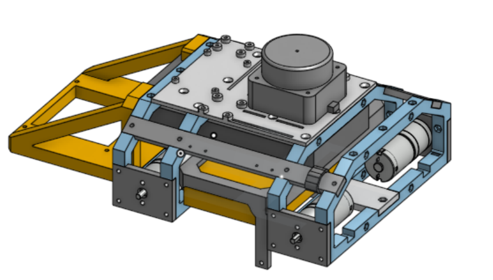
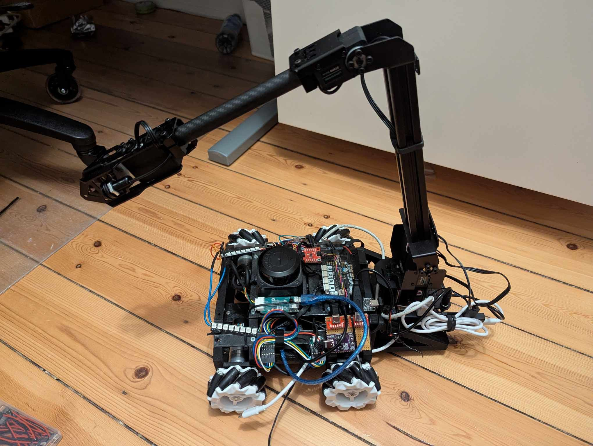

# Simplebot2

## Showcase Files

### 1. CAD Drawing
Image of the CAD drawing made in onshape. You can see the project [here](https://cad.onshape.com/documents/58d69eaf54d5097cb2ee2932/w/94ca09f7b1264f3339bd84c4/e/7cb0b81673ac10f236b6e9ed?renderMode=0&uiState=67c86245d6e5c919753ec178)

### 2. Robot with Arm
A image of the robot with an articulated arm. The arm in question is the waveshare RoArm-M2-S.

### 3. Autonomous Driving Demo
A demonstration video showcasing the autonomous driving functionality in action.

