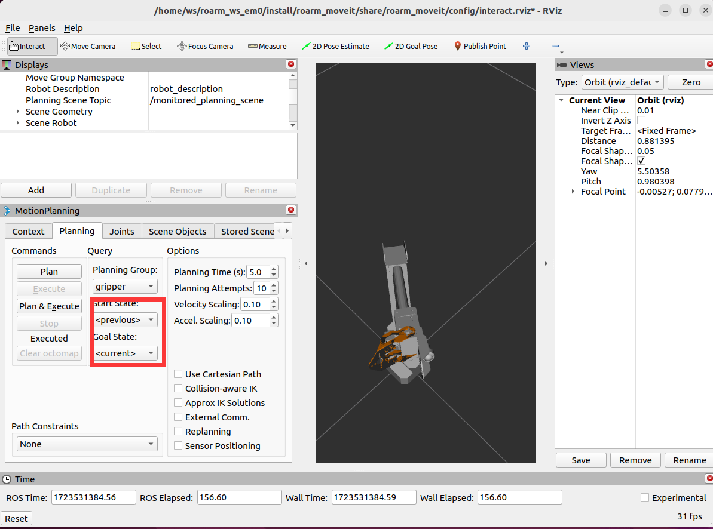
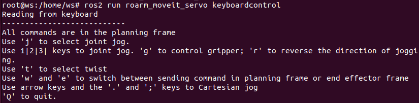
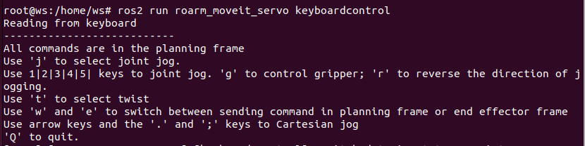
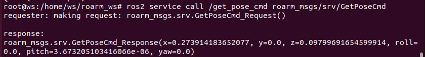
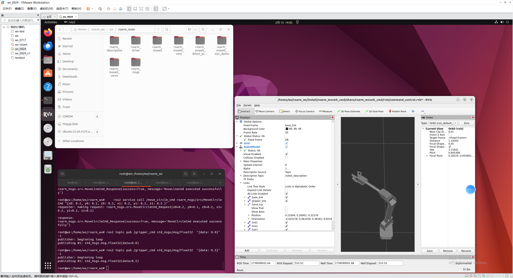
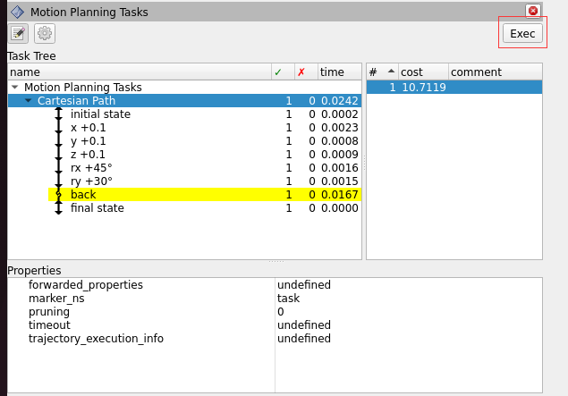

 

  


# ROS2 + Moveit2 for RoArm

## 1 Installing ROS2 Applications for RoArm on Ubuntu 22.04 (ROS2 Humble)
- Download the Ubuntu 22.04 image
    - Link: [Ubuntu 22.04.4 Desktop Image](https://releases.ubuntu.com/jammy/ubuntu-22.04.4-desktop-amd64.iso)
- Download and install Oracle VM VirtualBox
    - Link: [VirtualBox Downloads](https://www.virtualbox.org/wiki/Downloads)

### 1.1 Loading the Image File
- Run Oracle VM VirtualBox.
- Click on New → Enter a name → Choose a project folder (preferably on a disk with sufficient space) → Specify the virtual optical disk as the image file you just downloaded.
    - Note: Ensure to uncheck Skip Unattended Installation. Otherwise, in Oracle VM VirtualBox versions above 7.0, you might not have root permissions and might not be able to use the terminal.
- After proceeding, select the newly appeared image name on the left, click on Settings → Display → Screen, and increase the video memory if possible. If conditions allow, allocate 128 MB. Apply the settings.
- Double-click the image on the left, then select Try or Install Ubuntu.
- Install Ubuntu 22.04.

### 1.2 Downloading the Project and Installing Dependencies
Update software sources:

    sudo apt update

Upgrade the system:

    sudo apt upgrade

Install git:

    sudo apt install git

Then, clone the project from GitHub:

    git clone https://github.com/DUDULRX/roarm_ws.git

Install dependencies:

    sudo apt install software-properties-common
    sudo add-apt-repository universe
    
    sudo apt update && sudo apt install curl -y
    sudo curl -sSL https://raw.githubusercontent.com/ros/rosdistro/master/ros.key -o /usr/share/keyrings/ros-archive-keyring.gpg
    
    echo "deb [arch=$(dpkg --print-architecture) signed-by=/usr/share/keyrings/ros-archive-keyring.gpg] http://packages.ros.org/ros2/ubuntu $(. /etc/os-release && echo $UBUNTU_CODENAME) main" | sudo tee /etc/apt/sources.list.d/ros2.list > /dev/null
    
    sudo apt update
    sudo apt upgrade
    
    sudo apt install ros-humble-desktop
    sudo apt install ros-dev-tools
    sudo apt install net-tools
    sudo apt install ros-humble-moveit-*
    sudo apt remove ros-humble-moveit-servo-*
    sudo apt install ros-humble-generate-parameter-library
    sudo apt install ros-humble-pybinding-tools

Add ROS2 to the source
Source the setup script:

    echo "source /opt/ros/humble/setup.bash" >> ~/.bashrc
    source ~/.bashrc

Install Python3 libraries :

##### pip install

```bash
pip install -r requirements.txt
```

Initial compilation:

    cd /home/ws/roarm_ws
    sudo chmod +x build_first.sh
    . build_first.sh

Contents of build_first.sh (automatically run by the script; no manual execution required). This step may take a while to complete.

    cd /home/ws/roarm_ws
    colcon build --packages-select roarm_msgs 
    colcon build --packages-select moveit_servo 
    colcon build --packages-select rviz_marker_tools 
    colcon build --packages-select moveit_task_constructor_msgs 
    colcon build --packages-select moveit_task_constructor_core 
    colcon build --packages-select moveit_task_constructor_capabilities 
    colcon build --packages-select moveit_task_constructor_visualization 
    colcon build --packages-select roarm_moveit_cmd 
    colcon build --packages-select roarm_moveit_ikfast_plugins 
    colcon build --packages-select roarm_moveit_mtc_demo 
    colcon build --packages-select roarm_moveit_servo 
    colcon build --packages-select roarm_description roarm_driver roarm_moveit --symlink-install 
    echo "source /home/ws/roarm_ws/install/setup.bash" >> ~/.bashrc
    source ~/.bashrc 

Then, set the robotic arm model，

for roarm_m2

    echo "ROARM_MODEL=roarm_m2" >> ~/.bashrc 
    source ~/.bashrc 
for roarm_m3

    echo "ROARM_MODEL=roarm_m3" >> ~/.bashrc 
    source ~/.bashrc 
    
At this point, you can use the tutorial content. Some packages may generate stderr output during the compilation process, which can be ignored.

## 2 Roarm_ws Package Overview
roarm_ws is a workspace containing multiple ROS2 packages, each serving a specific purpose in the operation and control of robotic arms. Below is an overview of each package and its main functionalities:

roarm_main:

    1. roarm_description
    Robotic Arm Model:

    Contains the URDF (Unified Robot Description Format) files and other model descriptions necessary for simulating and visualizing the robotic arm.

    2. roarm_driver
    Driver for Real Robot:

    Responsible for interfacing with and controlling the physical robotic arm hardware.

    3. roarm_moveit
    Kinematic Configuration:

    Provides configurations for MoveIt, a motion planning framework, including setup files and parameters required for the kinematic control of the robotic arm.

    4. roarm_moveit_ikfast_plugins
    IKFast Kinematics Solver:

    Implements the IKFast kinematics solver, which is used for efficient and fast inverse kinematics calculations.

    5. roarm_msgs
    Message Definitions:

    Defines custom message types used for communication between different packages and components in the robotic arm system.
    
    6. roarm_moveit_cmd
    Control Commands:

    Includes scripts and nodes for sending control commands to the robotic arm, allowing for movement and task execution.

    7. roarm_moveit_servo
    Roarm Control:

    Enables control of the robotic arm using keyboard, allowing for intuitive manual operation.

    8. roarm_moveit_mtc_demo
    MTC Demo:

    Demonstrates the use of MoveIt Task Constructor (MTC) for complex robotic arm tasks, showcasing its capabilities in automating and simplifying robotic operations.

roarm_else:

    1. moveit_servo
    Arm Control:

    Enables control of the robotic arm using keyboard, allowing for intuitive manual operation.

    2. moveit_task_constructor
    MTC Planner:

    Provides a framework for constructing complex robotic arm tasks using MoveIt Task Constructor (MTC).

## 3 Controlling a Physical Robotic Arm with Driver Nodes
### 3.1 Connect the Robotic Arm and Identify the Serial Port
Before connecting the robotic arm via USB, check the current serial devices on your Ubuntu system:
    ls /dev/tty*

Then, connect the robotic arm. Be sure to connect to the Type-C port in the middle of the PCB board (the edge Type-C port is for radar connection and does not communicate with the ESP32). Click on `Devices → USB → select the device with "CP210x"` in its name from the Oracle VM VirtualBox menu. If prompted that the device cannot be mounted, you may need to shut down the virtual machine.

Ensure your computer (Windows) can detect this USB device.

Next, in the VM settings, locate the USB device section, check Enable USB Controller, select `USB 3.0 (xHCI)` Controller, and add a USB filter for the device with "CP210x" in its name. Click OK.

Run the VM again, and from the top menu, click Devices → USB → ensure there is a checkmark next to the device with "CP2102N USB".

Check the serial devices again:

    ls /dev/tty*

You should now see a new device like `/dev/ttyUSB0` at the end of the list. If not, disconnect and reconnect the robotic arm.

### 3.2 Running the Robotic Arm Driver Node
According to the ROS2 official documentation, it is not recommended to run ROS2 nodes in the same terminal where you compile the packages. Open a new terminal window using `Ctrl + Alt + T`.

Grant serial port permissions and run the ROS2 robotic arm driver node:

Grant read and write permissions to the serial device using the following command (replace `/dev/ttyUSB0` with your actual device path):

    sudo chmod 666 /dev/ttyUSB0

Run the driver node:

    ros2 run roarm_driver roarm_driver serial_port:=/dev/ttyUSB0

### 3.3 Viewing the Model Joints
Open a new terminal window with `Ctrl + Alt + T`.

Run Rviz2 to display the robotic arm model and the joint control panel:

Rviz2 is a visualization tool in ROS2 that can display and debug robot models, sensor data, path planning, and more. Using Rviz2, you can visually monitor the robot's movements and current position. Additionally, Rviz2 provides tools such as 3D views, timelines, and parameter adjustments to better understand the robot's behavior.

Note: When you run the following command, the robot's URDF in Rviz2 will publish the joint angles to the driver node. The driver node will convert these angles into JSON control commands for the robotic arm, causing it to move (the arm will be vertical). Ensure there are no fragile items around the robotic arm and keep children away.

    ros2 launch roarm_description display.launch.py

<video src="https://github.com/user-attachments/assets/a93bf92d-493e-42dc-b3bd-529b0b796220" controls="controls" width="500" height="300"></video>

<video src="https://github.com/user-attachments/assets/e818f88f-a4e7-45c9-9b53-630a1d1bb235" 
controls="controls" width="500" height="300"></video>

If you do not see the joint control panel, click the gear icon on the left to bring it to the forefront.

You can control the movement of each joint by dragging the sliders in the control panel. This is the simplest and most basic method to control the robotic arm in ROS2.

You can control the LED on the gripper of the robot arm through the following command,data is an integer, the range is [0-255].

    ros2 topic pub /led_ctrl std_msgs/msg/Float32 {"data: 0"} -1

### 3.4 Manipulating the View in Rviz2
In Rviz2, you can adjust the view of the robot model using the mouse:

Left-click and drag to move the view horizontally.
Right-click and drag to change the viewing direction and angle.
Scroll the mouse wheel to zoom in or out.
Press and hold the middle mouse button (wheel) and drag to move vertically.
These operations allow you to view the robot model from any angle and distance.


## 4 Interacting with the Robotic Arm End Effector Using MoveIt2
### 4.1 Introduction to MoveIt2
MoveIt2 is an open-source software for robotic motion planning, manipulation, and control. It provides a simple user interface to help developers handle complex motion planning problems.

MoveIt2 supports various algorithms and strategies, including motion planning, execution, monitoring, kinematics, and collision detection. Its powerful features make it widely used in industrial, research, and educational fields.

MoveIt2 operates within the ROS2 (Robot Operating System 2) environment and integrates seamlessly with other ROS2 tools and libraries, significantly improving the efficiency and convenience of robot development.

In this tutorial, we will use MoveIt2 to control the robotic arm's movements. By dragging the end effector of the robotic arm, MoveIt2 can automatically calculate the motion path and control the actual movement of the robotic arm through the driver nodes.

### 4.2 Running the MoveIt2 Demo
In the terminal window where Rviz2 is currently running, press `Ctrl + C` to close the Rviz2 session.

Run the following command to execute the robotic arm MoveIt2 demo. This demo includes inverse kinematics solving, allowing you to interact with the robotic arm by dragging the end effector:

    ros2 launch roarm_moveit roarm_moveit.launch.py 

When controlling the gripper, it should be selected as in the picture


Note: After executing this command, the robotic arm will move, with the forearm extending forward and parallel to the ground.

<video src="https://github.com/user-attachments/assets/d0ebc3ce-4761-40a7-8e54-b8d493a7fdc9" 
controls="controls" width="500" height="300"></video>

<video src="https://github.com/user-attachments/assets/7b70ffe4-ceb4-4014-a98d-f8188c0ba63d" 
controls="controls" width="500" height="300"></video>

If the robotic arm is not displayed in Rviz2, click on the `Fixed Frame` option in the Displays window after launching Rviz2. Beside `map`, a triangle icon will appear; click on this icon, select `world`, and press Enter to confirm.

Next, click on `Add` in the bottom left corner, then select `MotionPlanning` and click `OK`. This will display the robotic arm model. You can refer to the **3.5 Manipulating the View in Rviz2** section to change the view angle.

Now, you can change the posture of the robotic arm by dragging the sphere or XYZ axes at the end effector. This dragging will not immediately move the physical robotic arm. To execute the planned movements on the real robotic arm, you need to click the `Plan & Execute` button in the Planning tab on the right side of the screen.


## 5 Controlling the Robotic Arm with Keyboard
This chapter explains how to control the robotic arm using either keyboard keys or a gamepad. Note that the RoArm-M2-S does not come with a gamepad by default; you can purchase an Xbox Bluetooth gamepad and connect it to your computer for control.

Before running this section, you need to close the previously running MoveIt2 demo, but keep the roarm_driver node running, as it is necessary for controlling the physical robotic arm.

Enter the following command to start the nodes related to controlling the robotic arm:

    ros2 launch roarm_moveit_servo servo_control.launch.py

### 5.1 Keyboard Control
Open a new terminal and run the following command. This terminal window should remain active as it will receive control commands from the keyboard:

    ros2 run roarm_moveit_servo keyboardcontrol

Keep this terminal window active and use the following keys to control the robotic arm:

for roarm_m2:


<video src="https://github.com/user-attachments/assets/3b1e0cd4-7f5d-4b34-815c-9ff3c9fb8353" 
controls="controls" width="500" height="300"></video>

Coordinate Control:
- t Key: select twist mode
- w Key: planning frame "base_link"
- e Key: end effector frame "hand_tcp"
- Arrow Key ↑: Positive X direction
- Arrow Key ↓: Negative X direction
- Arrow Key ←: Negative Y direction
- Arrow Key →: Positive Y direction
- ; Key: Positive Z direction
- . Key: Negative Z direction

Joint Control:
- j Key: select joint jog mode
- 1 Key: Base joint
- 2 Key: Shoulder joint
- 3 Key: Elbow joint
- g Key: Gripper
- r Key: Switch direction of the above joint controls

for roarm_m3:


<video src="https://github.com/user-attachments/assets/74fa3424-3ceb-4f43-8879-948932a3bd58" 
controls="controls" width="500" height="300"></video>

Coordinate Control:
- t Key: select twist mode
- w Key: planning frame "base_link"
- e Key: end effector frame "hand_tcp"
- Arrow Key ↑: Positive X direction
- Arrow Key ↓: Negative X direction
- Arrow Key ←: Negative Y direction
- Arrow Key →: Positive Y direction
- ; Key: Positive Z direction
- . Key: Negative Z direction

Joint Control:
- j Key: select joint jog mode
- 1 Key: Base joint
- 2 Key: Shoulder joint
- 3 Key: Elbow joint
- 4 Key: wrist joint
- 5 Key: Roll joint
- g Key: Gripper
- r Key: Switch direction of the above joint controls

## 7 Command Control (Invoking ROS2 Services , Actions)
In this chapter, you will learn how to control the robotic arm using command-based control by invoking ROS2 services. Close all terminal windows from the previous chapters, except for the one running roarm_driver.

Run the launch file for command control, which relies on MoveIt2 for motion planning:

    ros2 launch roarm_moveit_cmd command_control.launch.py

Note: After executing this command, the robotic arm will move, with the forearm extending forward and parallel to the horizontal plane.

If the robotic arm is not displayed in Rviz2, follow these steps:

In Rviz2, click on the Displays window.

In the Fixed Frame field, click map, which will show a triangle icon.
Click the triangle icon and select base_link, then press Enter to confirm.
Click Add in the bottom left corner, select MotionPlanning, and click OK.
You should now see the robotic arm's model. Refer to 3.5 Rviz2 View Operations to adjust the view.

You can change the robotic arm's posture by dragging the end-effector's drag ball or XYZ axis in Rviz2. However, these changes will not synchronize with the physical robotic arm until you click Plan & Execute in the Planning tab on the right.

### 7.1 Get Current Position

Open another terminal to call the service that gets the current position:

    ros2 service call /get_pose_cmd roarm_msgs/srv/GetPoseCmd



### 7.2 Move the End-Effector to a Specified Pose

Call the service to control the end-effector's pose:

for roarm_m2:

    ros2 service call /move_joint_cmd roarm_msgs/srv/MoveJointCmd "{x: 0.2, y: 0, z: 0}"

<video src="https://github.com/user-attachments/assets/4900a917-1fdd-4e2a-9560-ef942d977248" 
controls="controls" width="500" height="300"></video>

for roarm_m3:

    ros2 service call /move_joint_cmd roarm_msgs/srv/MoveJointCmd "{x: 0.3, y: 0, z: 0.1, roll: 0.2, pitch: 0.2, yaw: 0}"

<video src="https://github.com/user-attachments/assets/601d052f-48e4-48f8-bc2b-32748a416e88" 
controls="controls" width="500" height="300"></video>

Here, x, y, and z are the coordinates of the target point in meters.
roll, pitch, and yaw are the rotation angles of the end-effector in radians.

By calling this service, you can control the robotic arm to move to the target pose.

### 7.3 Move the End-Effector to a Specified Pose at line trajectory(for roarm_m3,keep roll, pitch)

Call the service to make the robotic arm move to the specified pose at line trajectory:

    ros2 service call /move_line_cmd roarm_msgs/srv/MoveLineCmd "{x: 0.2, y: 0.2, z: 0.1}"

Here, x, y, and z are the coordinates of the target point in meters.

By calling this service, you can control the robotic arm to draw a circle at the desired position.

<video src="https://github.com/user-attachments/assets/2a3640dc-8719-459a-a271-f777fdbabb5c" 
controls="controls" width="500" height="300"></video>

<video src="https://github.com/user-attachments/assets/6f7cb9b1-ba04-48d5-adf3-e535a987da25" 
controls="controls" width="500" height="300"></video>

### 7.4 Move the End-Effector to a Specified Pose at arc trajectory(for roarm_m3,keep roll, pitch)

Call the service to make the robotic arm move to the specified pose at arc trajectory:

for roarm_m2:

    ros2 service call /move_circle_cmd roarm_msgs/srv/MoveCircleCmd "{x0: 0.2, y0: 0.1, z0: 0.2, x1: 0.2, y1: 0.2, z1: 0.2 }"

for roarm_m3:

ros2 service call /move_circle_cmd roarm_msgs/srv/MoveCircleCmd "{x0: 0.2, y0: 0.1, z0: 0.2, x1: 0.2, y1: 0.2, z1: 0.2 }"

Here, x0, y0, and z0 are the coordinates of the center point in meters.
x1, y1, and z1 are the coordinates of the target point in meters.

By calling this service, you can control the robotic arm move to the target pose at arc trajectory.

<video src="https://github.com/user-attachments/assets/2c58863a-0891-4318-b904-0ae17346ca59" 
controls="controls" width="500" height="300"></video>

<video src="https://github.com/user-attachments/assets/a9bb9617-6845-4c56-abe3-8e108debb415" 
controls="controls" width="500" height="300"></video>

By calling this service, you can control the robotic arm to draw a circle at the desired pose.

### 7.5 Control the gripper to the specified radian position

Publish data to a topic and use actions to control the radian position of the gripper:

    ros2 topic pub /gripper_cmd std_msgs/msg/Float32  "{data: 0.5}" -1

Here, the data is the coordinates of the target point of the gripper, in radians.
The gripper's range is 0.0~1.5.



By invoking this service, you can control the position of the robotic arm gripper to move the target radian.

## 8 Moveit MTC demo

After selecting the corresponding complete path, click "Exec" Button to execute the demo.



### 8.1 Cartesian demo
Run the launch file for MTC demo, which relies on MoveIt2 for mtc planning:

    ros2 launch roarm_moveit_mtc_demo demo.launch.py

Open a new terminal and run the following command to start the Moveit MTC demo:

    ros2 launch roarm_moveit_mtc_demo run.launch.py exe:=cartesian

<video src="https://github.com/user-attachments/assets/c465a960-e91e-4dda-bb04-a5426a71cd25" 
controls="controls" width="500" height="300"></video>

<video src="https://github.com/user-attachments/assets/571c1e8f-02e8-4d3e-9ca3-90f30af4f9d2" 
controls="controls" width="500" height="300"></video>

### 8.2 Cartesian Modular demo

Run the launch file for MTC demo, which relies on MoveIt2 for mtc planning:

    ros2 launch roarm_moveit_mtc_demo demo.launch.py

Open a new terminal and run the following command to start the Moveit MTC demo:

    ros2 launch roarm_moveit_mtc_demo run.launch.py exe:=exe:=cartesian_modular

<video src="https://github.com/user-attachments/assets/dee784fb-b0fe-403e-86de-576d95bf0c53" 
controls="controls" width="500" height="300"></video>

<video src="https://github.com/user-attachments/assets/ee04d449-083b-44a0-82ea-706ecf5a65cd" 
controls="controls" width="500" height="300"></video>

### 8.3 Pick Place demo

Run the launch file for MTC demo, which relies on MoveIt2 for mtc planning:

    ros2 launch roarm_moveit_mtc_demo demo.launch.py

Open a new terminal and run the following command to start the Moveit MTC demo:

    ros2 launch roarm_moveit_mtc_demo run.launch.py exe:=pick_place

<video src="https://github.com/user-attachments/assets/4719dfa7-7f53-428f-bdd5-b873e429cc6a" 
controls="controls" width="500" height="300"></video>

<video src="https://github.com/user-attachments/assets/c8d503ce-545e-49d3-a003-15dd505da9fc" 
controls="controls" width="500" height="300"></video>